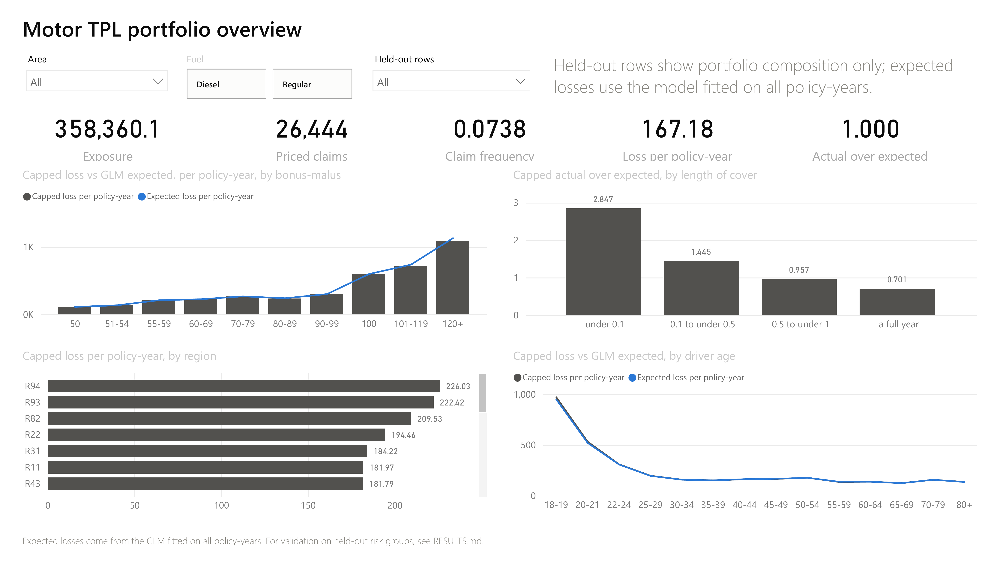
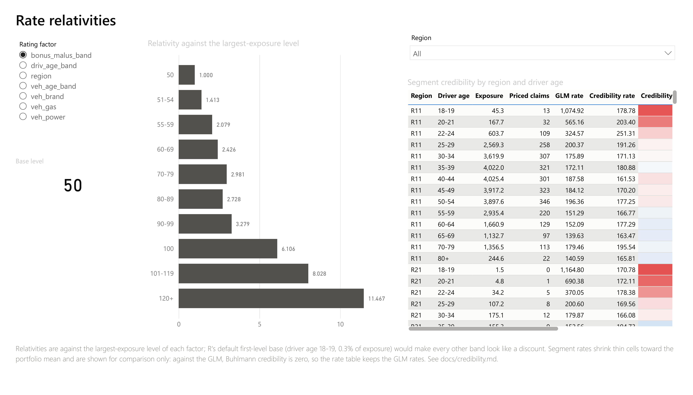

# motor-pricing-glm

Motor third-party-liability pricing on the public freMTPL2 portfolio. The pipeline runs from a
SQL data mart through frequency and severity GLMs in R to pure premium, a LightGBM benchmark
and validation in Python. It ends in a credibility-checked rate table exported to an Excel
workbook and a two-page Power BI report. 678,013 policy-years, 26,444 priced claims, 59.9 million of recorded
losses.

Every number below names its source in `RESULTS.md`. `DEVLOG.md` records how each decision was
made, including the ones that were wrong first.

## Results

| | GLM | LightGBM |
|---|---|---|
| Gini, ordered Lorenz on capped losses, risk-group holdout | 0.319 | 0.338 |
| Capped Tweedie deviance below a constant, holdout | 5.22% | 6.06% |
| Capped losses, actual over expected, holdout | 1.005 | 1.006 |

Paired bootstrap over 1,000 resamples of held-out risk groups, LightGBM minus GLM:

- **Gini on capped losses:** +0.020, 95% interval 0.005 to 0.035.
- **Deviance on capped losses:** 0.88% lower, interval 0.40% to 1.38%.
- **Gini on recorded losses:** −0.022, interval −0.080 to 0.026, no difference.

LightGBM ranks better, by a small margin that is real. The GLM gives the rate table.

## What was found on the way

- **The largest relativity was made of claims with no amount.** More than a quarter of reported
  claims have no amount. Fitted on reported claims, new vehicles carry a frequency relativity of 3.43; on
  claims with an amount, 0.98. A fifth of the unpriced claims are one count repeated on every
  piece of a fragmented policy-year. See `docs/pure-premium.md` and `docs/holdout-split.md`.
- **A split by policy id is a row split here, and it leaks.** 14% of rows are pieces of one
  policy-year. On `ClaimNb`, a profile-memorising model gains up to half of what all rating
  factors achieve, and LightGBM reads the leak back itself. Validation holds out whole risk
  groups.
- **Rebalancing hides units errors.** Every wrong exposure basis gets its total right after a
  rebalance and its prices wrong, so the off-balance step refuses anything beyond 1%.
  Tweedie boosting failed that check honestly, keeping only 96% of its total, and carries an
  explicit balance correction instead.
- **"Gini" has many versions.** On recorded losses the winner flips because of ten claims. An
  exposure-unweighted version gives a constant premium 0.17. See `docs/gini.md`.
- **Both models miss partial years identically.** Policy-years under 0.1 of a year run at 2.66
  of expected on the holdout, full years at 0.69. See `docs/calibration.md`.
- **The first factor level is a poor base.** R's default puts driver age 18-19, 0.3% of
  exposure, at 1.000. The rate table rebases every factor on its largest-exposure level, and
  a test confirms both tables price every policy identically.
- **Credibility against the model finds nothing to add.** The full credibility standard for
  capped pure premium is 5,062 claims, derived in `docs/credibility.md`. Buhlmann-Straub
  against the GLM estimates no between-segment variance, so Z = 0. The textbook complement,
  the portfolio mean, would price 18-19-year-olds at a quarter of both the GLM and their own
  experience.

## Layers

| Layer | What | Where |
|---|---|---|
| L1 | Raw, staging with a cleaning audit, star schema, segment mart | `migrations/`, `sql/transform/` |
| L2 | Poisson frequency GLM with an exposure offset, banded terms, clustered errors | `R/frequency*.R` |
| L3 | Capped Gamma severity GLM on priced claims, residual diagnostics | `R/severity*.R`, `R/model_diagnostics.R` |
| L4 | Pure premium, holdout, LightGBM, Gini, lift, calibration, bootstrap | `scripts/` |
| L5 | Rate relativities, credibility, normalization | `scripts/rate_table.py`, `docs/credibility.md` |
| L6 | Excel rate workbook and Power BI report | `scripts/export_rate_workbook.py`, `powerbi/` |
| L7 | This page, `RESULTS.md`, `DEVLOG.md`, `docs/for-business.md` | |

## Reproduce

Requires Docker, Python 3.14 and R 4.6. On Windows R is not on PATH; call `Rscript` by its
full path, and Python finds it through `RSCRIPT`, PATH or Program Files.

```bash
cp .env.example .env && docker compose up -d
python -m venv .venv && .venv/Scripts/python -m pip install -r requirements.txt
Rscript -e 'install.packages(c("DBI","RPostgres","dplyr","ggplot2","MASS"), type="binary")'

.venv/Scripts/python scripts/migrate.py        # structure
.venv/Scripts/python scripts/fetch_data.py     # download and verify pinned MD5s
.venv/Scripts/python scripts/load_raw.py all   # COPY into raw
.venv/Scripts/python scripts/transform.py      # staging, star schema

Rscript R/export_predictions.R                 # six GLM runs into model.glm_prediction, ~3 min
.venv/Scripts/python scripts/lightgbm_baseline.py   # tunes, fits and stores the benchmark, ~8 min
.venv/Scripts/python scripts/bootstrap_gap.py
.venv/Scripts/python scripts/export_rate_workbook.py  # exports/rate_workbook.xlsx, exports/powerbi/
.venv/Scripts/python -m pytest
```

The Power BI report opens from `powerbi/motor_pricing.pbip` once its `ExtractFolder`
parameter points at `exports/powerbi/`; see `powerbi/README.md`.




Most analysis documents in `docs/` are generated by the scripts named at their top, and
tests fail when a document no longer matches the data. The R analyses (`R/frequency_*.R`,
`R/severity_*.R`, `R/model_diagnostics.R`) and the Python reports
(`scripts/*_report.py`) regenerate them. `scripts/migrate.py --reset` rebuilds the database
from nothing.

## Data

freMTPL2 from OpenML (41214, 41215). `data/` is not committed; `fetch_data.py` downloads it and
checks the upstream MD5s it pins. Every command names `.venv/Scripts/python` because the
author's machine has two Python 3.14 installations; see `DEVLOG.md`.
