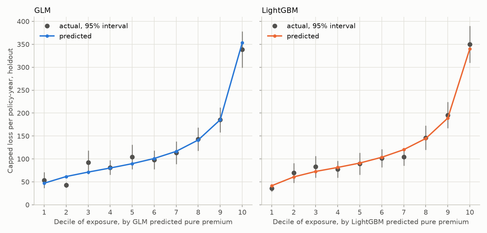
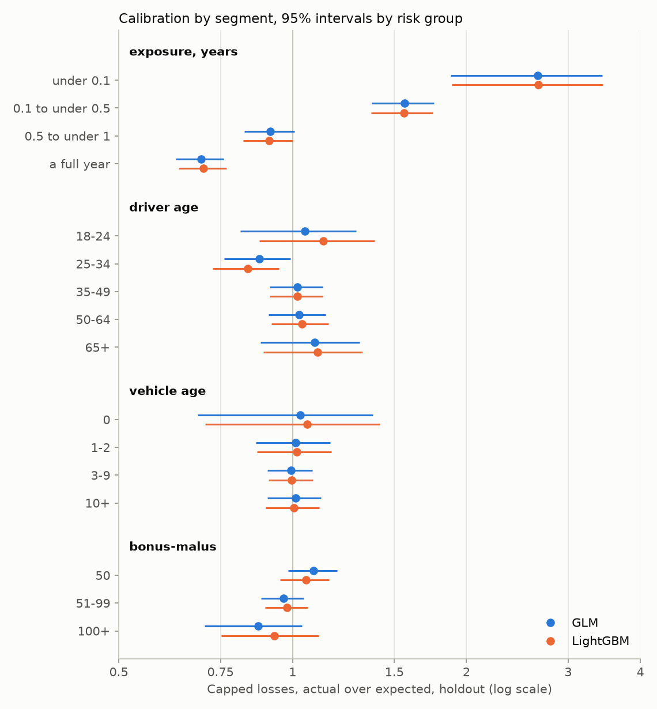

# Lift and calibration

Generated by `scripts/calibration_report.py`, which also draws `docs/figures/decile-lift.png` and
`docs/figures/calibration-by-segment.png`. Do not edit by hand; re-run the script.

Frame md5 `2ecb69783bcd2387d8e00d6b88335ae2`. Risk-group holdout, 135,455 policy-years and 5,311 priced claims.
GLM run `priced_claims_risk_group_split`, benchmark run `lightgbm_risk_group_split`. Python 3.14.7.

**Rules, fixed before computing.** Deciles hold equal exposure, ordered by each model's own
predicted pure premium per policy-year, with identical predictions kept in one decile. Segments
are exposure under 0.1, 0.1 to under 0.5, 0.5 to under 1 and a full year; driver age 18-24,
25-34, 35-49, 50-64 and 65+; vehicle age 0, 1-2, 3-9 and 10+; bonus-malus 50, 51-99 and 100+.
Actual over expected uses capped losses, with recorded losses beside it. Intervals are 95%,
from the variance of actual minus expected summed within risk groups. A segment counts as
miscalibrated only if its interval excludes 1.

## Decile lift

| Decile | GLM predicted | GLM actual [95%] | GLM recorded A/E | LightGBM predicted | LightGBM actual [95%] | LightGBM recorded A/E |
|---|---|---|---|---|---|---|
| 1 | 47.0 | 53.6 [36.4, 70.8] | 0.85 | 41.5 | 36.1 [28.5, 43.7] | 0.65 |
| 2 | 61.5 | 42.9 [37.0, 48.8] | 0.52 | 60.7 | 69.6 [48.0, 91.1] | 1.98 |
| 3 | 71.3 | 92.5 [66.6, 118.4] | 1.62 | 72.7 | 82.8 [59.3, 106.3] | 1.28 |
| 4 | 80.1 | 81.2 [65.3, 97.0] | 0.88 | 81.4 | 77.6 [59.2, 95.9] | 0.89 |
| 5 | 89.6 | 104.4 [77.7, 131.0] | 1.67 | 91.0 | 89.6 [65.4, 113.8] | 1.22 |
| 6 | 101.0 | 97.8 [77.4, 118.1] | 0.93 | 103.6 | 101.3 [81.6, 120.9] | 0.94 |
| 7 | 116.5 | 113.4 [88.9, 137.9] | 0.99 | 120.2 | 104.0 [85.0, 123.1] | 0.64 |
| 8 | 141.3 | 143.3 [118.0, 168.7] | 0.99 | 144.6 | 146.2 [119.5, 173.0] | 0.81 |
| 9 | 185.4 | 185.1 [158.2, 212.1] | 0.76 | 189.0 | 195.6 [167.3, 223.9] | 0.96 |
| 10 | 353.2 | 338.5 [299.3, 377.8] | 0.90 | 340.2 | 349.9 [309.7, 390.1] | 0.94 |

Predicted and actual are capped loss per policy-year.

Both models' actual losses climb with their predictions. The top decile's actual capped loss rate is
6.3 times the bottom decile's for the GLM and 9.7 times for LightGBM, against predicted
ratios of 7.5 and 8.2. LightGBM reaches further at both ends: its bottom decile runs at
36.1 against the GLM's 53.6, its top at 349.9 against 338.5. The GLM's first two deciles are out of order, 53.6 then
42.9.

Deciles whose interval excludes 1: GLM decile 2; LightGBM none. Among twenty
intervals, about one would exclude 1 by chance.

On recorded losses the same deciles swing from 0.52 to 1.67 of expected for the GLM and
from 0.64 to 1.98 for LightGBM. On capped losses they run from 0.70 to 1.30 and from
0.87 to 1.15. That is why the chart is drawn on capped losses.

## Calibration by segment

| Dimension | Segment | Exposure | Priced claims | GLM A/E [95%] | LightGBM A/E [95%] | GLM recorded A/E | LightGBM recorded A/E |
|---|---|---|---|---|---|---|---|
| exposure, years | under 0.1 | 1.9% | 245 | 2.658 [1.88, 3.44] | 2.665 [1.88, 3.45] | 2.14 | 2.14 |
| exposure, years | 0.1 to under 0.5 | 17.6% | 1,396 | 1.564 [1.37, 1.76] | 1.559 [1.37, 1.75] | 1.74 | 1.74 |
| exposure, years | 0.5 to under 1 | 33.2% | 1,838 | 0.916 [0.82, 1.01] | 0.911 [0.82, 1.00] | 0.91 | 0.91 |
| exposure, years | a full year | 47.2% | 1,832 | 0.694 [0.63, 0.76] | 0.702 [0.63, 0.77] | 0.56 | 0.57 |
| driver age | 18-24 | 3.5% | 409 | 1.050 [0.81, 1.29] | 1.131 [0.87, 1.39] | 1.09 | 1.17 |
| driver age | 25-34 | 18.1% | 964 | 0.876 [0.76, 0.99] | 0.837 [0.73, 0.95] | 0.76 | 0.72 |
| driver age | 35-49 | 36.6% | 1,893 | 1.020 [0.91, 1.13] | 1.020 [0.91, 1.13] | 0.91 | 0.91 |
| driver age | 50-64 | 28.4% | 1,467 | 1.025 [0.91, 1.14] | 1.037 [0.92, 1.15] | 0.98 | 0.99 |
| driver age | 65+ | 13.4% | 578 | 1.093 [0.88, 1.31] | 1.105 [0.89, 1.32] | 1.46 | 1.47 |
| vehicle age | 0 | 4.6% | 233 | 1.030 [0.68, 1.38] | 1.061 [0.70, 1.42] | 0.84 | 0.86 |
| vehicle age | 1-2 | 17.5% | 927 | 1.012 [0.86, 1.16] | 1.018 [0.87, 1.17] | 1.14 | 1.14 |
| vehicle age | 3-9 | 41.8% | 2,328 | 0.993 [0.90, 1.08] | 0.996 [0.91, 1.08] | 0.96 | 0.96 |
| vehicle age | 10+ | 36.0% | 1,823 | 1.012 [0.90, 1.12] | 1.006 [0.90, 1.11] | 0.93 | 0.93 |
| bonus-malus | 50 | 62.6% | 2,383 | 1.088 [0.98, 1.19] | 1.055 [0.95, 1.16] | 1.14 | 1.10 |
| bonus-malus | 51-99 | 34.7% | 2,423 | 0.964 [0.88, 1.05] | 0.979 [0.90, 1.06] | 0.90 | 0.92 |
| bonus-malus | 100+ | 2.7% | 505 | 0.872 [0.70, 1.04] | 0.931 [0.75, 1.11] | 0.71 | 0.76 |

Exposure is where both models miss, and they miss identically. Policy-years under 0.1 of a
year run at 2.66 and 2.67 of expected, full years at 0.69 and 0.70. Policy-years of half a year
or more but short of a full year are within noise. This is D3-1's partial-year gap, found
in-sample, now on held-out risk groups. LightGBM does not close it because neither model is
given exposure as an input: both price a policy-year and scale it pro rata, by design.

Outside exposure, one segment's interval excludes 1, and for both models: drivers aged 25-34,
at 0.876 and 0.837. Among the 24 intervals outside exposure, about one would exclude 1
by chance, and the two models' errors are correlated, so it is recorded here and not acted on.
Vehicle age and bonus-malus are within noise for both.

## Handed on

- **D3-6:** bootstrap the Gini and deviance gaps over risk groups.
- **D4:** a full-year rate carries the partial-year gap. Full policy-years run at 0.69 of
  expected on the holdout, and the rate table has to say whether the claims of short
  policy-years belong in a full-year price. Drivers aged 25-34 are worth a second look there.
