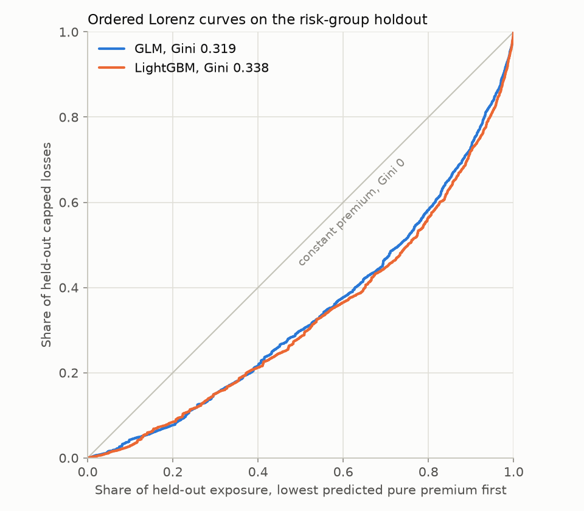

# Gini

Generated by `scripts/gini_report.py`, which also draws `docs/figures/lorenz-curves.png`. Do not
edit by hand; re-run the script.

Frame md5 `2ecb69783bcd2387d8e00d6b88335ae2`. Risk-group holdout, 135,455 policy-years and 5,311 priced claims.
GLM run `priced_claims_risk_group_split`, benchmark run `lightgbm_risk_group_split`. Python 3.14.7.

**Rule, fixed before computing.** The Gini reported for this project is the ordered Lorenz Gini
on capped losses, defined below. The same Gini on recorded losses is shown beside it. Every
other version is computed to show what it would say, and none is reported.

## The reported Gini

**Definition.** Sort held-out policy-years by predicted pure premium per policy-year, lowest
first, merging policy-years with identical predictions into one step. Plot cumulative share of
exposure on the x-axis against cumulative share of capped losses on the y-axis. The Gini is
1 minus twice the area under that curve: 0 for a model that charges everyone the same, and
higher the more of the losses sit at the expensive end.

| Model | Gini, capped losses (reported) | Gini, recorded losses | Reported Gini over the best possible ordering |
|---|---|---|---|
| constant | 0.000 | 0.000 | 0.000 |
| GLM | 0.319 | 0.291 | 0.325 |
| LightGBM | 0.338 | 0.269 | 0.345 |

On capped losses LightGBM ranks better, 0.338 against 0.319. On recorded losses the order reverses,
0.291 against 0.269. The ten largest held-out policy losses are 21.8% of recorded losses, and
the largest is 399,214. A Lorenz curve on recorded losses jumps wherever one of them lands,
and without those ten policy-years LightGBM leads again, 0.358 against 0.333. The reversal is
about where ten claims landed. Both models price large losses with the same flat load, which is
why the capped Gini is the one that measures what they rate. Whether either gap is larger than
the holdout's noise is D3-6's question.

Dividing by the best possible ordering, sorting by actual capped loss per policy-year, changes
little, because that ordering reaches 0.981 on data this sparse.

## Other things called Gini

The same held-out rows and predictions under each version. The noisy GLM multiplies every GLM
prediction by an independent lognormal factor with sigma = 1, mean 1: the same model with its
ranking deliberately degraded.

| Version | constant | GLM | LightGBM | noisy GLM |
|---|---|---|---|---|
| ordered Lorenz, capped losses (reported) | 0.000 | 0.319 | 0.338 | 0.133 |
| ordered Lorenz, recorded losses | 0.000 | 0.291 | 0.269 | 0.083 |
| ordered Lorenz, sorted highest premium first | 0.000 | -0.319 | -0.338 | -0.133 |
| ordered Lorenz, ties broken by policy id | -0.068 | 0.319 | 0.338 | 0.133 |
| unweighted by exposure, normalized, sorted by premium per year | 0.131 | 0.256 | 0.267 | 0.101 |
| unweighted by exposure, normalized, sorted by expected loss | 0.168 | 0.327 | 0.339 | 0.214 |
| 2 × AUC − 1, any priced claim | 0.000 | 0.223 | 0.232 | 0.108 |
| Gini coefficient of the predicted premiums | 0.000 | 0.337 | 0.335 | 0.597 |

- **Sorted highest premium first.** The same formula returns the negative. The sign carries the
  direction of the sort, so a negative Gini usually means the sort was reversed, not that the
  model is worse than a constant.
- **Ties broken by policy id.** Only the constant model moves, to -0.068, because its every
  prediction is a tie. Policy id order is not neutral here: the lower half of held-out ids has a
  capped loss rate of 134.8 per policy-year and a mean exposure of 0.578, against 113.9 and
  0.481 for the upper half. The GLM has 104,757 distinct predictions on 135,455 rows, and
  breaking its ties by id moves its Gini by less than 0.0005.
- **Unweighted by exposure.** This is the version common in machine-learning competitions:
  rows sorted by prediction, each row counted once, normalized by the actual ordering. A
  constant model scores 0.131 from row order alone. Sorted by expected loss, exposure times
  the annual rate, it scores 0.168: credit for row order and for knowing how long each
  policy ran, which is the units mistake D3-1 guards against in another form.
- **2 × AUC − 1.** Ranks policies with and without a claim. It ignores claim size and
  exposure, so it measures a different thing, though here it orders the models the same way.
- **Gini coefficient of the predicted premiums.** This measures how spread out the prices are,
  not whether they are right. The noisy GLM has the widest spread, 0.597, and the worst
  reported Gini, 0.133. The GLM and LightGBM spread their prices almost equally, 0.337 and 0.335.

## Handed on

- **D3-5:** lift and calibration use the same holdout and the same ordering by predicted pure
  premium per policy-year.
- **D3-6:** bootstrap the Gini gap over risk groups, on capped losses, where LightGBM leads by
  0.020, and on recorded losses, where the GLM leads by 0.022.
