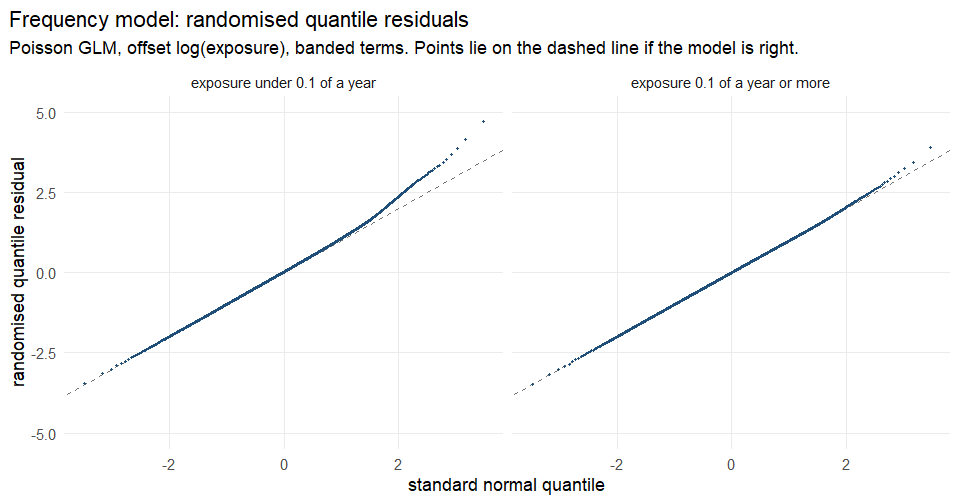
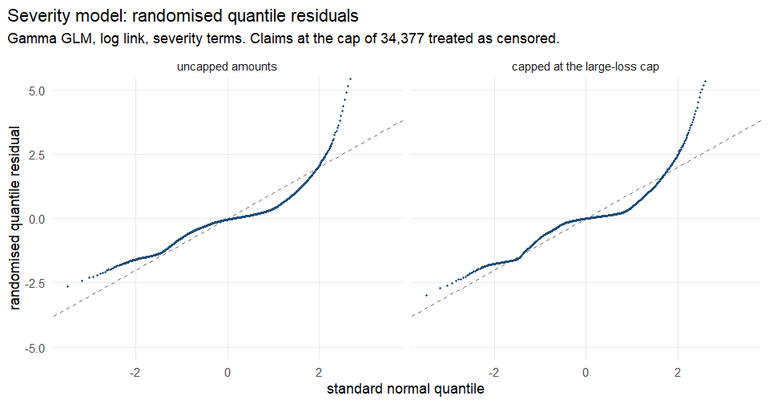

# Model diagnostics

Generated by `R/model_diagnostics.R`. Do not edit by hand; re-run the script.

Computed from `model.frequency_frame`, frame md5 `2ecb69783bcd2387d8e00d6b88335ae2`, and `model.severity_frame`, 26,444 claims. R version 4.6.1 (2026-06-24 ucrt).

Both models are checked with randomised quantile residuals. For a correctly
specified model they are standard normal, so each panel should follow its dashed
line, about 5% should fall beyond ±1.96, and the 0.1st and 99.9th percentiles should
sit near -3.09 and 3.09. Residuals are drawn with a fixed seed, and the plots are
clipped at ±5, so the most extreme severity residuals run off the top edge.

## Frequency

| Residuals | Rows | Beyond ±1.96 (5% if right) | 0.1st percentile (-3.09) | 99.9th percentile (3.09) |
|---|---|---|---|---|
| all policy-years | 678,013 | 5.41% | -3.09 | 3.48 |
| exposure under 0.1 of a year | 121,553 | 6.62% | -3.09 | 3.96 |
| exposure 0.1 of a year or more | 556,460 | 5.14% | -3.10 | 3.33 |

On exposures of 0.1 of a year or more, 5.14% of residuals fall beyond ±1.96. Under 0.1 of a year it is 6.62%, and the upper tail lifts away from the line. That is the non-proportionality D2-2 measured, visible as a shape: short policy-years carry more claims than an offset allows, so their claims land further into the upper tail of the fitted Poisson distribution than chance would put them.

## Severity

Both panels use the pricing severity terms. In the right-hand panel claims are capped at 34,377 and the 133 claims at the cap are treated as censored.

| Residuals | Rows | Beyond ±1.96 (5% if right) | 0.1st percentile (-3.09) | 99.9th percentile (3.09) |
|---|---|---|---|---|
| uncapped amounts | 26,444 | 3.01% | -2.37 | 7.03 |
| capped at the large-loss cap | 26,444 | 4.49% | -2.65 | 6.40 |

Gamma shape estimated by maximum likelihood: 0.787 on uncapped amounts and 0.996 capped. A Pearson estimate is not used because a handful of very large claims dominate it.

The Gamma assumption does not hold, capped or not, and capping hardly changes that. Both panels are S-shaped. The lower tail sits above the line, so small claims are less extreme than the fitted Gamma expects. The middle is flatter than the line, so claims bunch together more tightly than a Gamma distribution does. The upper tail climbs far above it: the 99.9th percentile of the residuals is 7.03 uncapped and 6.40 capped, against 3.09.

The bunching in the middle has a plain cause. A large share of claims are exactly
the same amount:

| Claim amount | Claims | Share of claims |
|---|---|---|
| 1,204.00 | 4,792 | 18.1% |
| 1,128.12 | 3,056 | 11.6% |
| 1,172.00 | 2,071 | 7.8% |
| 1,128.00 | 831 | 3.1% |
| 602.00 | 433 | 1.6% |

The four most common amounts hold 40.7% of all claims, and 43.2% lie between 1,100 and 1,250. Amounts repeated that exactly look like standard settlement figures rather than individually assessed losses; the data does not say where they come from. No continuous distribution fitted to the whole range can put that much mass on a handful of points, which is why the middle of both panels is flat.

Capped, the upper tail stays high for a different reason. The fitted Gamma, with a shape near 1, gives a claim at the cap a probability so small that a capped claim's residual lands around 6, while 0.50% of claims actually reach the cap.

What this means for the model. A Gamma GLM estimates the mean consistently when the
mean is right, whatever the true distribution, and pure premium needs only the mean:
capped, the mean model converges quickly and its fitted amounts balance to capped
losses (docs/severity-large-losses.md). Nothing else should be taken from its
distribution. Tail probabilities, simulated claims, or anything that prices a limit
or an excess from the fitted Gamma would be wrong.
